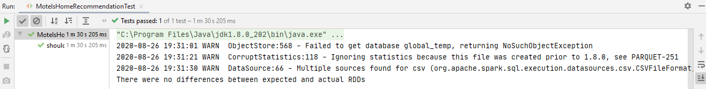

# Spark SQL Travel Meta Recommendation
-----------------------

## Spark SQL

* Spark SQL is a Spark module for structured data processing. 
* It provides a programming abstraction called DataFrames and can also act as a distributed SQL query engine.
* It also provides powerful integration with the rest of the Spark ecosystem (e.g., integrating SQL query processing with machine learning).

## Test Cases Result:
 

  
 
In the above screenshot, we can see that our test case has been passed. And there is no difference between actual & expected RDD's. 

**Created by:**  
**Name: Krishna Kumar Singh**  
**Email: krishnaai265@gmail.com**  
**Phone: +91-9368754996** 
